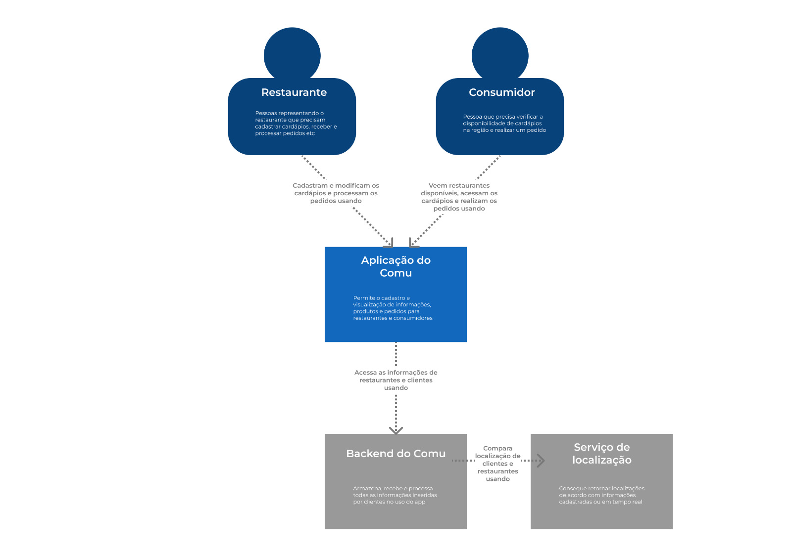
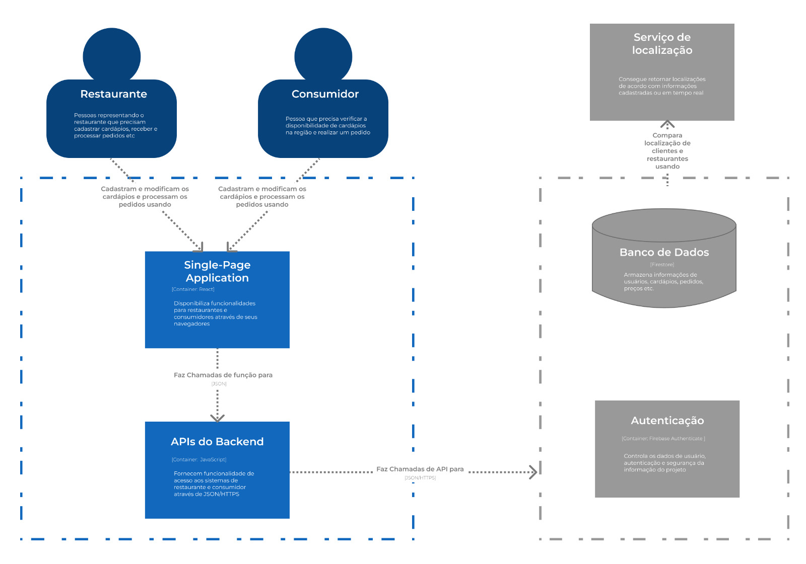
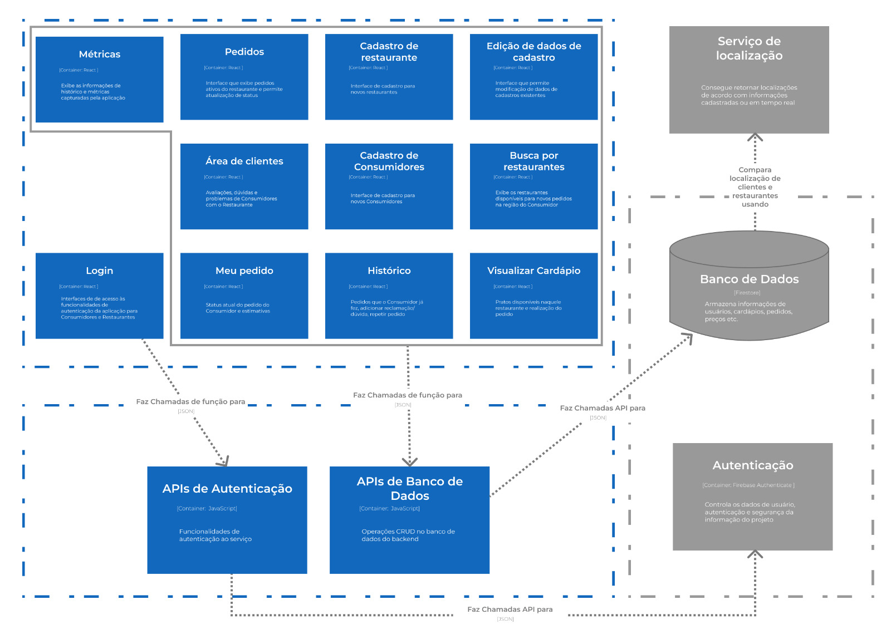

# 🛵  _Comu_ 
### 💻 [UNICAMP][1S2023] MC426 • Engenharia de Software

#

### 🧑‍🤝‍🧑 Autores

_**Comu**_ é um projeto criado e desenvolvido por:

195334 ∷ Camila Porfírio da Silva Pinto  
174817 ∷ João Victor Pereira de Andrade  
256453 ∷ Jonas Cardoso Gonçalves  
221859 ∷ Mariana Megumi Izumizawa  
187462 ∷ Thales Iwashima Andrade  

#

### 📔 A Disciplina

A disciplina MC426 (Engenharia de Software) da Unicamp tem como objetivos terminais que alunes,
ao final do semestre, sejam capazes de:

- Compreender a necessidade de métodos e práticas adequadas para o desenvolvimento de sistemas
de software (in-the-large).
- Desenvolver um sistema de software utilizando um ciclo de vida (fim-a-fim), incluindo métodos, 
práticas e ferramentas adequados para as atividades de requisitos, projeto e testes de software. 

De forma prática, ao longo do curso, desenvolvemos o projeto _**Comu**_ aplicando os conhecimentos
apresentados em aula.

#

### 🗒️ Descrição do Projeto

O _**Comu**_ consiste num software livre de delivery de refeições/compras de mercado que 
possibilita a formação e funcionamento de cooperativas locais de maneira independente ao
iFood/UberEats/Rappi; a ideia é que hajam taxas customizáveis e ferramentas que permitam 
uma diversidade de modelos de negócio, que seja fácil de subir e que de fato auxilie os
trabalhadores sem submeter tanto restaurantes quanto entregadores a más condições de trabalho.

#

### 🛠 Execução

Primeiramente, instale o nvm para instalar o Node posteriormente.

##### `curl -o- https://raw.githubusercontent.com/nvm-sh/nvm/v0.34.0/install.sh | bash`

##### `nvm install 16.16.0`

A seguir, no diretório do projeto, execute os seguintes comandos:

- **`npm i`**
  - Inicia e instala todos os pacotes e dependências do projeto.
- **`npm run start`**
  - Esse comando faz com que a aplicação seja executada em modo desemvolvimento.\
Abra [http://localhost:3000](http://localhost:3000) no navegador, caso isso não seja feito de
forma automática.
  - A página vai recarregar de forma automática, isso significa que suas mudanças são
refletidas quase que instantaneamente.
- **`npm run test`**
  - Inicia o executor de teste no modo interativo.
- **`npm run predeploy`**
  - Contrói a aplicação em modo produção para a pasta `target/classes/public`.
- **`npm run deploy`**
  - Atualiza a branch gh-pages de acordo com a última atualização da pasta `target/classes/public`.

#

### 🏗️ Arquitetura

< !-- Descrição da arquitetura considerando os requisitos atuais da aplicação, contendo: -->

#### Diagramas em nível de componentes

O diagrama em nível de componentes é uma representação visual da arquitetura de software em um nível
mais detalhado, focando nos componentes individuais que compõem o sistema e nas suas interações. O
diagrama em nível de componentes faz parte da abordagem C4 (Context, Container, Component, Code), 
que é uma técnica de modelagem arquitetural para representar a arquitetura de software de forma 
clara e concisa.

No contexto do C4, o diagrama em nível de componentes (Nível 3) é uma expansão do diagrama em nível
de contêineres (Nível 2), que mostra os principais componentes internos de cada contêiner. Ele permite
uma visão mais detalhada da estrutura interna dos contêineres e como os componentes se relacionam.

O objetivo do diagrama em nível de componentes é fornecer uma visão mais detalhada da estrutura interna
do sistema, mostrando como os componentes se organizam e como eles se comunicam entre si. Ele auxilia na
compreensão da arquitetura, na identificação de pontos de acoplamento e na definição de fronteiras e 
responsabilidades claras entre os componentes.

##### Diagrama Nível 1 - Context

##### Diagrama Nível 2 - Containers

##### Diagrama Nível 3 - Components

#### Estilo Adotado na Elaboração da Arquitetura

O estilo adotado na elaboração da arquitetura foi o modelo MVC (*Model-View-Controller*), que 
se revelou como uma escolha natural em virtude das tecnologias selecionadas.

Na camada de View do nosso projeto, encontra-se a interface desenvolvida em React, que está 
integrada ao repositório no GitHub. 

A camada Controller é baseada em nossa camada interna de APIs, que é invocada pela interface.

A camada de Model concentra-se principalmente no Firestore, um serviço de banco de dados
fornecido pelo Firebase, juntamente com as funcionalidades e serviços internos oferecidos pela
plataforma Firebase. O Firebase é conhecido por ser um serviço "_Back-end as a Service_" (BaaS),
o que facilita a abstração dessa parte do projeto.

#### Principais Componentes e Suas Responsabilidades

##### Métricas
\[REACT\]
Componente por exibir para os Restaurantes informações de histórico de pedidos recebidos e também as métricas que foram capturadas pela aplicação. Exibe informações como dias com mais pedidos, pratos que mais saem, dias e pratos que tiveram mais reclamações, faturamento, crescimento, rapidez, desempenho, clientes que retornaram.

##### Pedidos
\[REACT\]
Neste componente o Restaurante pode acompanhar os pedidos ativos que foram recebidos, mudar seu status e gerenciar os estados de preparo e entrega. Exibe qual o pedido e quais opções foram selecionadas pelo Consumidor, quais os comentários e pedidos especiais, possui um botão de contato rápido para avisar de algo ou fazer alguma pergunta direto pra quem fez o pedido.

##### Cadastro de restaurante
\[REACT\]
Interface de registro padrão para novos Restaurantes, com informações básicas sobre o negócio.

##### Edição de dados de cadastro
\[REACT\]
Interface que permite a Restaurantes e Consumidores editarem seus dados de registro, modificarem informações, atualizarem dados e também apagarem seus cadastros da plataforma.

##### Área de clientes
\[REACT\]
Aqui Restaurantes podem acompanhar as Avaliações, as dvidas e os problemas que os Consumidores tiveram com seus pedidos nesse Restaurante e permite a interação para melhor corrigir essas falhas.

##### Cadastro de Consumidores
\[REACT\] Interface padrão que permite o cadastro de novos Consumidores com informações básicas pessoais.

##### Busca por restaurantes
\[REACT\] Página através da qual os Consumidores poderão ver quais os restaurantes disponíveis em sua região onde eles podem verificar os cardápios e fazerem os pedidos. Lista restaurantes com nome, descrição, foto, distância e categoria.

##### Login
\[REACT\] Interface de inserção dos dados de autenticação que permitem que um Restaurante ou Consumidor acesse o serviço disponibilizado de acordo com sua categoria.

##### Meu pedido
\[REACT\] Quando um Consumidor faz um pedido, ele é direcionado para essa página, onde ele pode acompanhar o status de preparo e entrega de seu pedido e também ter uma forma fácil e prática de contato com o Restaurante.

##### Histórico
\[REACT\] O Histórico apresenta ao Consumidor quais pedidos ele já fez anteriormente, para poder deixar sua avaliação, reclamação e também poder repeti-lo com poucos toques.

##### Visualizar Cardápio
\[REACT\] Nesta tela, o Consumidor pode verificar o que tem de disponível no restaurante escolhido e fazer seu pedido.

##### APIs de Autenticação
\[Javascript/Axios\] APIs que formam a conexão com a API de autenticação do back-end.

##### APIs de Banco de Dados
\[Javascript/Axios\] APIs que formam a conexão com a API de banco de dados do back-end.

##### Autenticação
\[Firebase Authenticate\] Serviço de autenticação e gerenciamento de usuários com API disponibilizada.

##### Banco de Dados
\[Firestore\] Serviço de banco de dados NoSQL com API disponibilizada

##### Serviço de Localização
Serviço capaz de adquirir, representar e comparar localizações de Restaurantes e Consumidores.

#

⋰ 🛵 ⋱ 🌭 ⋰ 🍔 ⋱ 🍟 ⋰ 🍕 ⋱ 🥙 ⋰ 🌮 ⋱ 🌯 ⋰ 🫔 ⋱ 🥗 ⋰ 🍝 ⋱ 🍛 ⋰ 🍱 ⋱ 🧁 ⋰ 🍪 ⋱ 🍩 ⋰
